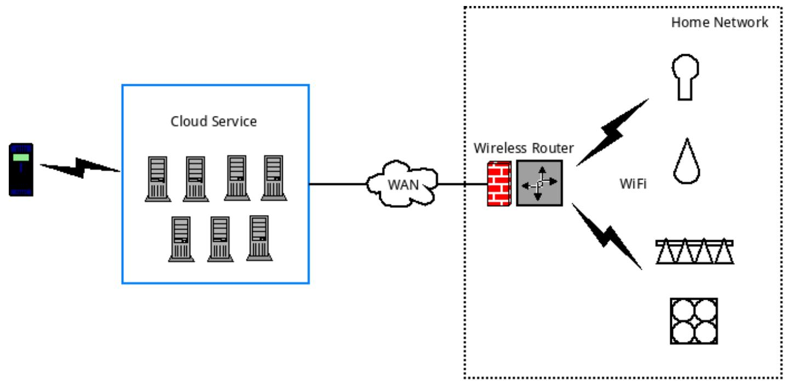
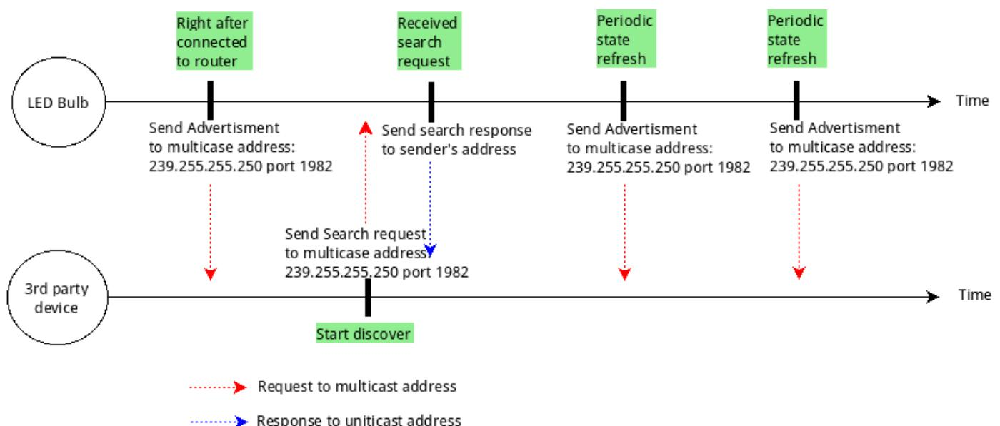
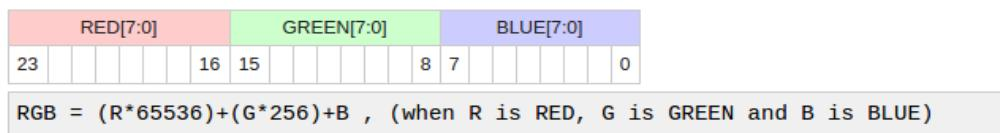

# Yeelight WiFi Light Inter-Operation Specification

<www.yeelight.com>

## Table of contents

1 Introduction 2  
2 Overview 2  
3 Local Discovery 3  
3.1 Search request and response 4  
3.2 Advertisement 6  
4 Control Protocol. 8  
4.1 COMMAND message 8  
4.2 RESULT message 19  
4.3 NOTIFICATION message 20  
5 Issues and Future consideration 21  
6 Reference. 21

### 1 Introduction

Yeelight smart LED products support remote control through WiFi. When user received the smart LED device for the first time, he/she needs to complete a configuration procedure to provision the router's SSID and password to the device. This procedure is normally called SmartConfig or QuickConnect. Due to security consideration, the protocol used for SmartConfig is proprietary, which means no  \(3^{\text{rd}}\)  party could know about it or use it. However, after the device is connected to the router, it can be seen by all the devices under the same network, thus could also be controlled by  \(3^{\text{rd}}\)  party equipment that understands the inter-operation control protocol.

The purpose of this document is to help  \(3^{rd}\)  party equipment vendors that want to work with Yeelight smart devices or users who are willing to play with the device with their own softwares to understand the technical details of discovering and controlling of the device.

# 2 Overview

Currently, Yeelight WiFi LED is controlled through cloud. The command will be sent to a cloud server and then forwarded to the device.

  
Figure 2-1

As Figure 2-1 shows, all the WiFi LEDs are keep in touch with cloud server. If the cloud server is down or the WAN network undergoes some issue, then user will lose control of the

device. Therefore we think local control is very necessary and begin to work on the local control mechanism.

Local control can be further divided into two parts: the discovery procedure and the control procedure. For local discovery, we used a sSDP like protocol but it's greatly simplified. For control protocol, we define a set of control commands that expressed in JSON. The two parts will be explained in great detail in section 3 and 4.

## 3 Local Discovery

As SSDP defined, there are actually two kinds of discover message: searching and advertising messages. Searching is used by device that wants to find other devices or services that it has interests while advertising is used by any device that is willing to announce it's presence on the network.

Yeelight smart LED supports both kinds of message. It will listen on a multi-cast address, waiting for any incoming search requests. If the request is targeted for Yeelight smart LED (ST header contains Yeelight pre-defined value), then the device will uni-cast a response to the searcher. The response contains some basic information about the device, e.g. IP and port of the control service, current power status, current brightness as well as all the supported control methods. So when the searcher received the response, it can get the basic idea of the device. With these information, it can do further contact and control. The advertising message is sent by Yeelight smart LED after it joined the network or after a fixed period of time (this is to refresh its state). The message is sent to a multi-cast address with some basic information. The receiver of the message should not respond to the advertisement.

  
Figure 3-1 shows the discover procedure.  
Figure 3-1

Different from SSDP protocol, we choose to send multi-cast messages to port 1982 instead of standard SSDP port 1900. This is to avoid excessive multi-cast messages being received by both smart LED and  \(3^{\text{rd}}\)  party devices. It's especially important if the  \(3^{\text{rd}}\)  party device is power consumption-sensitive (e.g. smart watch powered by battery).

### 3.1 Search request and response

The searching message generated by  \(3^{\text{rd}}\)  device should follow below format and rules and being sent to multi-cast address 239.255.255.250:1982 over UDP.

M-SEARCH \*HTTP/1.1

HOST: 239.255.255.250:1982

MAN:"ssdp:discover"

ST: wifi_bulb

1. The start line must be "M-SEARCH * HTTP/1.1" without any leading LWP.  
2. "HOST" header is optional, if it's present, the value should be "239.255.255.250:1982".  
3. "MAN" header is required. The value for "MAN" header must be "ssdp:discover", double quotes included.  
4. "ST" header is required. The value for "ST" header must be "wifi_bulb".  
5. The headers are case-insensitive while the start line and all the header values are case sensitive. Each line should be terminated by "\r\n".

Any messages that doesn't follow above rules will be silently dropped, which means the searching device won't be able to find any Yeelight smart LED. If the message is deemed as a valid request, the response message will be generated by Yeelight smart LED and uni-casted to request sender's sending IP and port. For instance, if the request is sent by 192.168.1.22 on UDP port 43210, then response will be sent to 192.168.1.22:43210. The response will be in following format.

HTTP/1.1 200 OK

Cache-Control:max-age  \(= 3600\)

Date:

Ext:

Location: yeelight://192.168.1.239:55443

Server:POSIX UPnP/1.0 YGLC/1

id: 0x000000000015243f

model: color

fw_ver: 18

support: get_prop set_default set_power toggle set_bright start_cf stop_cf setscene

cron_add cron_get cron_del set_ct_abx set_rgb

power: on

bright: 100

color_mode: 2

ct: 4000

rgb: 16711680

hue: 100

sat: 35

name: my_bulb

The start line will always be "HTTP/1.1 200 OK".

"CACHE-CONTROL" field contains the status refresh interval. Smart LED will send another advertisement message after that amount of seconds.

"LOCATION" field contains the service access point of the smart LED device. The URI scheme will always be "yeelight", host is the IP address of smart LED, port is control service's TCP listen port.

"DATE", "EXT" and "SERVER" header doesn't contain any important information, it's there just to confirm with SSDP.

All other headers are Yeelight specific.

"ID": The ID of a Yeelight WiFi LED device,  \(3^{\text{rd}}\)  party device should use this value to uniquely identified a Yeelight WiFi LED device.

"MODEL": The product model of a Yeelight smart device. Current it can be "mono", "color", "stripe", "ceiling", "bslamp". For "mono", it represents device that only supports brightness adjustment. For "color", it represents device that support both color and color temperature adjustment. "Stripe" stands for Yeelight smart LED stripe. "Ceiling" stands for Yeelight Ceiling Light. More values may be added in future.

"FW_VER": LED device's firmware version.

"SUPPORT": All the supported control methods separated by white space.  \(3^{\text{rd}}\)  party device can use this field to dynamically render the control view to user if necessary. Any control request that invokes method that is not included in this field will be rejected by smart LED.

"POWER": Current status of the device. "on" means the device is currently turned on, "off" means it's turned off (not un-powered, just software-managed off).

"BRIGHT": Current brightness, it's the percentage of maximum brightness. The range of this value is  \(1 \sim 100\) .

"COLOR_MODE": Current light mode. 1 means color mode, 2 means color temperature mode, 3 means HSV mode.

"CT": Current color temperature value. The range of this value depends on product model, refer to Yeelight product description. This field is only valid if COLOR_MODE is 2.

"RGB": Current RGB value. The field is only valid if COLOR_MODE is 1. The value will be explained in next section.

"HUE": Current hue value. The range of this value is 0 to 359. This field is only valid if COLOR_MODE is 3.

"SAT": Current saturation value. The range of this value is 0 to 100. The field is only valid if COLOR_MODE is 3.

"NAME": Name of the device. User can use "set_name" to store the name on the device. The maximum length is 64 bytes. If none-ASCII character is used, it is suggested to BASE64 the name first and then use "set_name" to store it on device.

NOTE: HUE and SAT should be used in combination. CT mode, RGB mode and HSV mode are mutually exclusively.

After  \(3^{\mathrm{rd}}\)  party device received the response, it's recommended to do following operations:

1. Parsing and validate the response message.  
2. Identify the device, check if the device is already maintained in local storage by searching local database by ID.  
3. Display the status to user if necessary.  
4. Follow the information in "LOCATION" header to establish a TCP connection with the WiFi smart LED.  
5. After the TCP connection is successfully established, send control message to control the smart LED or monitor the status change of the device and display any change to user.

### 3.2 Advertisement

Right after Yeelight smart LED joined the local network, it will announce its presence by multi-casting an advertisement requests. The purpose of this message is to notify  \(3^{\text{rd}}\)  party devices that smart LED is online and ready to serve control request. Without this advertisement message,  \(3^{\text{rd}}\)  party devices would have to probe the network from time to time in order to achieve PnP (plug and play), which is obviously power-consuming and inefficient.

After the initial announcement, Yeelight smart LED will refresh its state by sending the advertisement message at a fixed interval. The format of the advertisement message is:

NOTIFY \* HTTP/1.1

Host: 239.255.255.250:1982

Cache-Control:max-age  \(= 3600\)

Location: yeelight://192.168.1.239:55443

NTS: ssdp:alive

Server:POSIX,UPnP/1.0 YGLC/1

id: 0x000000000015243f

model: color

fw_ver: 18

support: get_prop set_default set_power toggle set_bright start_cf stop_cf setscene

cron_add cron_get cron_del set_ct_abx set_rgb

power: on

bright: 100

color_mode: 2

ct: 4000

rgb: 16711680

hue: 100

sat: 35

name: my_bulb

The start line will always be "NOTIFY * HTTP/1.1".

"NTS" header's value will always be "ssdp:alive".

"CACHE-CONTROL" field contains the status refresh interval. Smart LED will send another advertisement message after that amount of seconds.

"LOCATION" field contains the service access point of the smart LED. The URI scheme will always be "yeelight", host is the IP address of smart LED, port is control service's TCP listen port.

All Yeelight specific headers are exactly same as those in search response message. (See section 3.1)

After  \(3^{\mathrm{rd}}\)  party device received the advertisement, it's recommended to do following operations:

1. Parsing and validate the response message.  
2. Identify the device, check if the device is already maintained in local storage by searching local database by ID.  
3. If the device is already in local storage, refresh its state and display to user.

4. If the device is not found in local storage, present the new device to user.  
5. Follow the information in "LOCATION" header to establish a TCP connection with the WiFi smart LED.  
6. After the TCP connection is successfully established, send control message to control the device or monitor the status change of the device and display any change to user.

# 4 Control Protocol

When the local discovery procedure is completed, a control plane could be established between  \(3^{\text{rd}}\)  party devices and smart LEDs, which from then on will be used to carry control protocol messages that are encoded in JSON format.

Yeelight smart LED control protocol defined 3 types of messages: COMMAND message, RESULT message and NOTIFICATION message. All messages must be delivered in defined JSON format on a TCP connection and each individual message must be terminated by "\r\n". If user could know the IP of the smart LED, then he/she can simply use "telnet" to establish the control channel (telnet <IP> 55443) and then send and receive any control commands. This is helpful for debugging and trouble shooting during development.

NOTE: Currently WiFi smart device support up to 4 simultaneous TCP connections, any further connect attempt will be rejected. For each connection, there is a command message quota, that is 60 commands per minute. There is also a total quota for all the LAN commands: 144 commands per minute  \((4 \times 60 \times 60\%)\) .

## 4.1 COMMAND message

COMMAND message is generated by  \(3^{\text{rd}}\)  party devices and sent to smart LED. The format of the command is defined as below:

{id_pair, method_pair, params_pair}\r\n

<table><tr><td>Pair</td><td>Presence</td><td>String</td><td>Value</td></tr><tr><td>id_pair</td><td>mandatory</td><td>&quot;id&quot;</td><td>int(val)</td></tr><tr><td>method_pair</td><td>mandatory</td><td>&quot;method&quot;</td><td>string(method_val)</td></tr><tr><td>params_pair</td><td>mandatory</td><td>&quot;params&quot;</td><td>array.params_val)</td></tr></table>

The value of "id" is an integer filled by message sender. It will be echoed back in RESULT message. This is to help request sender to correlate request and response.

The value of "method" is a string that specifies which control method the sender wants to invoke. The value must be chosen by sender from one of the methods that listed in

"Support" header in advertisement request or search response message. Otherwise, the message will be rejected by smart LED.

The value of "params" is an array. The values in the array are method specific.

### Example

{"id":1,"method":"set_power","params":[ "on", "smooth", 500]}

Following is the list of all supported methods and parameters.

<table><tr><td>Method value</td><td>Paramete
rs Count</td><td>Param 1</td><td>Param 2</td><td>Param 3</td><td>Param 4</td></tr><tr><td>get_prop</td><td>1 ~ N</td><td>*</td><td>*</td><td>*</td><td>*</td></tr><tr><td>set_ct_abx</td><td>3</td><td>int (ct_value)</td><td>string-effect)</td><td>int(duration)</td><td></td></tr><tr><td>set_rgb</td><td>3</td><td>int(rgb_value)</td><td>string-effect)</td><td>int(duration)</td><td></td></tr><tr><td>set_hsv</td><td>4</td><td>int(hue)</td><td>int(sat)</td><td>string-effect)</td><td>int(duration)</td></tr><tr><td>set_bright</td><td>3</td><td>int(brightness)</td><td>string-effect)</td><td>int(duration)</td><td></td></tr><tr><td>set_power</td><td>3</td><td>string(power)</td><td>string-effect)</td><td>int(duration)</td><td>int(mode)</td></tr><tr><td>toggle</td><td>0</td><td></td><td></td><td></td><td></td></tr><tr><td>set_default</td><td>0</td><td></td><td></td><td></td><td></td></tr><tr><td>start_cf</td><td>3</td><td>int(count)</td><td>int(action)</td><td>string-flow_expr
sion)</td><td></td></tr><tr><td>stop_cf</td><td>0</td><td></td><td></td><td></td><td></td></tr><tr><td>set scene</td><td>3 ~ 4</td><td>string(class)</td><td>int(val1)</td><td>int(val2)</td><td>* int(val3)</td></tr><tr><td>cron_add</td><td>2</td><td>int(type)</td><td>int(value)</td><td></td><td></td></tr><tr><td>cron_get</td><td>1</td><td>int(type)</td><td></td><td></td><td></td></tr><tr><td>cron_del</td><td>1</td><td>int(type)</td><td></td><td></td><td></td></tr><tr><td>set_adjust</td><td>2</td><td>string(action)</td><td>string(prop)</td><td></td><td></td></tr><tr><td>set_music</td><td>1 ~ 3</td><td>int(action)</td><td>string(host)</td><td>int.port)</td><td></td></tr><tr><td>set_name</td><td>1</td><td>string(name)</td><td></td><td></td><td></td></tr><tr><td>bg_set_rgb</td><td>3</td><td>int(rgb_value)</td><td>stringeffect)</td><td>int(duration)</td><td></td></tr><tr><td>bg_set_hsv</td><td>4</td><td>int(hue)</td><td>int(sat)</td><td>string效果)</td><td>int(duration)</td></tr><tr><td>bg_set_ct_abx</td><td>3</td><td>int (ct_value)</td><td>string(result)</td><td>int(duration)</td><td></td></tr><tr><td>bg_start_cf</td><td>3</td><td>int(count)</td><td>int(action)</td><td>string flow_expr
sion)</td><td></td></tr><tr><td>bg_stop_cf</td><td>0</td><td></td><td></td><td></td><td></td></tr><tr><td>bg_set_structure</td><td>3 ~ 4</td><td>string(class)</td><td>int(val1)</td><td>int(val2)</td><td>* int(val3)</td></tr><tr><td>bg_set_default</td><td>0</td><td></td><td></td><td></td><td></td></tr><tr><td>bg_set_power</td><td>3</td><td>string(power)</td><td>string(result)</td><td>int(duration)</td><td>int(mode)</td></tr><tr><td>bg_set_bright</td><td>3</td><td>int(brightness)</td><td>string(result)</td><td>int(duration)</td><td></td></tr><tr><td>bg_set_adjust</td><td>2</td><td>string(action)</td><td>string(prop)</td><td></td><td></td></tr><tr><td>bg Toggle</td><td>0</td><td></td><td></td><td></td><td></td></tr><tr><td>dev Toggle</td><td>0</td><td></td><td></td><td></td><td></td></tr><tr><td>adjust_bright</td><td>2</td><td>int(percentage)</td><td>int(duration)</td><td></td><td></td></tr><tr><td>adjust_ct</td><td>2</td><td>int(percentage)</td><td>int(duration)</td><td></td><td></td></tr><tr><td>adjust_color</td><td>2</td><td>int(percentage)</td><td>int(duration)</td><td></td><td></td></tr><tr><td>bg_adjust_bright</td><td>2</td><td>int(percentage)</td><td>int(duration)</td><td></td><td></td></tr><tr><td>bg_adjust_ct</td><td>2</td><td>int(percentage)</td><td>int(duration)</td><td></td><td></td></tr><tr><td>bg_adjust_color</td><td>2</td><td>int(percentage)</td><td>int(duration)</td><td></td><td></td></tr></table>

Table 4-1

Detailed explanation for each method:

Method: get_prop

Usage: This method is used to retrieve current property of smart LED.

Parameters: 1 to N.

The parameter is a list of property names and the response contains a list of corresponding property values. If the requested property name is not recognized by smart LED, then a empty string value ("") will be returned.

Request Example: {"id":1,"method":"get_prop","params":[power,"not Exist","bright]}\n\n

Response Example: {"id":1, "result": ["on", "", "100"]}

NOTE: All the supported properties are defined in table 4-2, section 4.3

Method: set_ct_abx

Usage: This method is used to change the color temperature of a smart LED.

Parameters: 3.

"ct_value" is the target color temperature. The type is integer and range is  \(1700 \sim 6500\)  (k).

"effect" support two values: "sudden" and "smooth". If effect is "sudden", then the color temperature will be changed directly to target value, under this case, the third parameter "duration" is ignored. If effect is "smooth", then the color temperature will be changed to target value in a gradual fashion, under this case, the total time of gradual change is specified in third parameter "duration".

"duration" specifies the total time of the gradual changing. The unit is milliseconds. The minimum support duration is 30 milliseconds.

Request Example: {"id":1,"method":"set_ct_abx","params":[3500, "smooth", 500]}

Response Example: {"id":1,"result":["ok"]}

NOTE: Only accepted if the smart LED is currently in "on" state.

Method: set_rgb

Usage: This method is used to change the color of a smart LED.

Parameters: 3.

"rgb_value" is the target color, whose type is integer. It should be expressed in decimal integer ranges from 0 to 16777215 (hex: 0xFFFFFFF).

### RGB color format & calculation

RGB code has 24 bits format (bits 0..23):

"effect": Refer to "set_ct_abx" method.

"duration": Refer to "set_ct_abx" method.

Request Example: {"id":1,"method":"setrgb","params":[255, "smooth", 500]}

Response Example: {"id":1,"result":["ok"]}

NOTE: Only accepted if the smart LED is currently in "on" state.

Method: set_hsv

Usage: This method is used to change the color of a smart LED.

Parameters: 4.

"hue" is the target hue value, whose type is integer. It should be expressed in decimal integer ranges from 0 to 359.

"sat" is the target saturation value whose type is integer. It's range is 0 to 100.

"effect": Refer to "set_ct_abx" method.

"duration": Refer to "set_ct_abx" method.

Request Example: {"id":1,"method":"set_hsv","params":[255,45,"smooth",500]}

Response Example: {"id":1,"result":["ok"]}

NOTE: Only accepted if the smart LED is currently in "on" state.

Method: set_bright

Usage: This method is used to change the brightness of a smart LED.

Parameters: 3.

"brightness" is the target brightness. The type is integer and ranges from 1 to 100. The brightness is a percentage instead of a absolute value. 100 means maximum brightness while 1 means the minimum brightness.

"effect": Refer to "set_ct_abx" method.

"duration": Refer to "set_ct_abx" method.

Request Example: {"id":1,"method":"set_bright","params":[50,"smooth",500]}

Response Example: {"id":1,"result":["ok"]}

NOTE: Only accepted if the smart LED is currently in "on" state.

Method: set_power

Usage: This method is used to switch on or off the smart LED (software

managed on/off).

Parameters: 3.

"power" can only be "on" or "off". "on" means turn on the smart LED, "off" means turn off the smart LED.

"effect": Refer to "set_ct_abx" method.

"duration": Refer to "set_ct_abx" method.

"mode" (optional):

0: Normal turn on operation (default value)  
1: Turn on and switch to CT mode.  
2: Turn on and switch to RGB mode.  
3: Turn on and switch to HSV mode.  
4: Turn on and switch to color flow mode.  
5: Turn on and switch to Night light mode. (Ceiling light only).

Request Example: {"id":1,"method":"set_power","params":[ "on", "smooth", 500]}

Response Example: {"id":1,"result":["ok"]}

NOTE: N/A

Method: toggle

Usage: This method is used to toggle the smart LED.

Parameters: 0.

Request Example: {"id":1,"method":"toggle","params":[]}

Response Example: {"id":1,"result":["ok"]}

NOTE: This method is defined because sometimes user may just want to flip the state without knowing the current state.

Method: set_default

Usage: This method is used to save current state of smart LED in persistent memory. So if user powers off and then powers on the smart LED again (hard power reset), the smart LED will show last saved state.

Parameters: 0.

Request Example: {"id":1,"method":"set_default","params":[]}

Response Example: {"id":1,"result":["ok"]}

NOTE: For example, if user likes the current color (red) and brightness (50%) and want to make this state as a default initial state (every time the smart LED is powered), then he can use set_default to do a snapshot.

Only accepted if the smart LED is currently in "on" state.

### Method: start cf

Usage: This method is used to start a color flow. Color flow is a series of smart LED visible state changing. It can be brightness changing, color changing or color temperature changing. This is the most powerful command. All our recommended scenes, e.g. Sunrise/Sunset effect is implemented using this method. With the flow expression, user can actually "program" the light effect.

### Parameters: 3

"count" is the total number of visible state changing before color flow stopped. 0 means infinite loop on the state changing.

"action" is the action taken after the flow is stopped.

0 means smart LED recover to the state before the color flow started.

I means smart LED stay at the state when the flow is stopped.

2 means turn off the smart LED after the flow is stopped.

"flow_expression" is the expression of the state changing series.

Request Example: {"id":1,"method":"start_cf","params":[4,2,"1000,2,2700,100,500,1, 255,10,5000,7,0,0,500,2,5000,1"]

Response Example: {"id":1,"result":["ok"]}

NOTE: Each visible state changing is defined to be a flow tuple that contains 4 elements: [duration, mode, value, brightness]. A flow expression is a series of flow tuples. So for above request example, it means: change CT to 2700K & maximum brightness gradually in 1000ms, then change color to red &  \(10\%\)  brightness gradually in 500ms, then stay at this state for 5 seconds, then change CT to 5000K & minimum brightness gradually in 500ms. After 4 changes reached, stopped the flow and power off the smart LED.

[duration, mode, value, brightness]:

Duration: Gradual change time or sleep time, in milliseconds,

minimum value 50.

Mode: 1 - color, 2 - color temperature, 7 - sleep.

Value: RGB value when mode is 1, CT value when mode is 2,

Ignored when mode is 7.

Brightness: Brightness value, -1 or 1 ~ 100. Ignored when mode is 7.

When this value is -1, brightness in this tuple is ignored (only color or CT change takes effect).

Only accepted if the smart LED is currently in "on" state.

The logic can be expressed in following pseudo code.

+start_cf:

cnt = 0

while true:

if flow_cnt != 0 and cnt >= flow_cnt:

take_stop_action.flow_action)

break

tuple = get_next_flow_tuple()

apply-effect(tuple)

flow tuple will be put in a circular list

change RGB/CT gradually or sleep

Method: stop_cf

Usage: This method is used to stop a running color flow.

Parameters: 0.

Request Example: {"id":1,"method":"stop_cf","params":[]}

Response Example: {"id":1,"result":["ok"]}

NOTE: N/A

Method: setscene

Usage: This method is used to set the smart LED directly to specified state. If the smart LED is off, then it will turn on the smart LED firstly and then apply the specified command.

Parameters:  \(3\sim 4\)

"class" can be "color", "hsv", "ct", "cf", "auto_dealy_off".

"color" means change the smart LED to specified color and

brightness.

"hsv" means change the smart LED to specified color and brightness.

"ct" means change the smart LED to specified ct and brightness.

"cf" means start a color flow in specified fashion.

"auto_delay_off" means turn on the smart LED to specified

brightness and start a sleep timer to turn off the light after the specified minutes.

"val1", "val2", "val3" are class specific.

Request Example: {"id":1,"method":"set_structure","params": ["color", 65280, 70]}

{"id":1,"method":"setscene","params": ["hsv",300,70,100]}\n\n

{"id":1,"method":"set_structure","params":[ "ct",5400,100]}

{"id":1,

"method":"setscene","params":["cf",0,0,"500,1,255,100,1000,1,16776960,70"]}

{"id":1,"method":"setscene","params":[ "auto_delay_off",50,5]

Response Example: {"id":1,"result":["ok"]}

NOTE: Accepted on both "on" and "off" state.

For above examples:

The first is to set color to "652280" and  \(70\%\)  brightness.

The second is to set color to Hue:300, Saturation:70 and max brightness.

The third is set CT to 500K and  \(100\%\)  brightness.

The forth one is to start a infinite color flow on two flow tuples.

The fifth one is turn on the light to  \(50\%\)  brightness and then turn off

after 5 minutes.

Method: cron_add

Usage: This method is used to start a timer job on the smart LED.

Parameters: 2.

"type" currently can only be 0. (means power off)

"value" is the length of the timer (in minutes).

Request Example: {"id":1,"method":"cron_add","params":[0,15]}

Response Example: {"id":1,"result":["ok"]}

NOTE: For example, if a user wants to start a sleep timer (automatically turn off the smart LED after 20 minutes), then he can send a

{"id":1,"method":"cron_add","params":[0,20]}.

Only accepted if the smart LED is currently in "on" state.

Method: cron_get

Usage: This method is used to retrieve the setting of the current cron job of the

specified type.

Parameters: 1.

"type" the type of the cron job. (currently only support 0).

Request Example: {"id":1,"method":"cron_get","params":[0]}

Response Example: {"id":1,"result":[{"type":0,"delay":15,"mix":0}]}

NOTE: N/A

Method: cron_del

Usage: This method is used to stop the specified cron job.

Parameters: 1.

1.

"type" the type of the cron job. (currently only support 0).

Request Example: {"id":1,"method":"cron_del","params":[0]}

Response Example: {"id":1,"result":["ok"]}

NOTE: N/A

Method: set_adjust
Usage: This method is used to change brightness, CT or color of a smart LED
without knowing the current value, it's main used by controllers.
Parameters: 2. "action" the direction of the adjustment. The valid value can be: "increase": increase the specified property "decrease": decrease the specified property "circle": increase the specified property, after it reaches the max
value, go back to minimum value. "prop" the property to adjust. The valid value can be: "bright": adjust brightness. "ct": adjust color temperature. "color": adjust color. (When "prop" is "color", the "action" can only
be "circle", otherwise, it will be deemed as invalid request.)
Request Example: {"id":1,"method":"set_adjust","params":[  \(" \mathrm { i n c e s s e } "\)  , "ct"]}
Response Example: {"id":1, "result":[  \("\mathrm{ok}"\) ]}
NOTE: N/A

Method: set_adjust
Usage: This method is used to change brightness, CT or color of a smart LED
without knowing the current value, it's main used by controllers.
Parameters: 2. "action" the direction of the adjustment. The valid value can be: "increase": increase the specified property "decrease": decrease the specified property "circle": increase the specified property, after it reaches the max value,
go back to minimum value. "prop" the property to adjust. The valid value can be: "bright": adjust brightness. "ct": adjust color temperature. "color": adjust color. (When "prop" is "color", the "action" can only be "circle", otherwise, it will be deemed as invalid request.)
Request Example: {"id":1,"method":"set_adjust","params":[  \(" \text{i} \text{e} \text{n} \text{e} \text{s} \text{e} \text{a} \text{r} \text{u} \text{t} \text{y} \text{a} \text{t} \text{u} \text{t} \text{a} \text{t} \text{u} \text{t} \text{a} \text{t} \text{u} \text{t} \text{a} \text{t} \text{u} \text{t} \text{a} \text{t} \text{u} \text{t} \text{a} \text{t} \text{u} \text{u} \text{u} \text{u} \text{u} \text{u} \text{u} \text{u} \text{u} \text{u} \text{u} \text{u} \text{u} \text{u} \text{u} \text{u} \text{u} \text{u} \text{u} \text{u} \text{a}\)
Response Example: {"id":1,"result":"ok"]}
NOTE: N/A

### Method: set_music

Usage: This method is used to start or stop music mode on a device. Under music mode, no property will be reported and no message quota is checked.

### Parameters: 1\~3

"action" the action of set_music command. The valid value can be:

0: turn off music mode.

1: turn on music mode.

"host" the IP address of the music server.

"port" the TCP port music application is listening on.

Request Example: {"id":1,"method":"set_music","params":[1,“192.168.0.2",54321]}

{"id":1,"method":"set_music","params":[0]}

### Response Example: {"id":1,"result":["ok"]}

NOTE: When control device wants to start music mode, it needs start a TCP server firstly and then call "set_music" command to let the device know the IP and Port of the TCP listen socket. After received the command, LED device will try to connect the specified peer address. If the TCP connection can be established successfully, then control device could send all supported commands through this channel without limit to simulate any music effect. The control device can stop music mode by explicitly send a stop command or just by closing the socket.

### Method: set_name

Usage: This method is used to name the device. The name will be stored on the device and reported in discovering response. User can also read the name through "get_prop" method.

### Parameters: 1

"name" the name of the device.

Request Example: {"id":1,"method":"set_name","params":[my_bulb]}\n\n

Response Example: {"id":1,"result":["ok"]}

NOTE: When using Yeelight official App, the device name is stored on cloud.

This method instead store the name on persistent memory of the device, so the two names could be different.

### Method: bg_set_xxx / bg toggle

Usage: These methods are used to control background light, for each command detail, refer to set_xxx command.

### Parameters

### Request Example

### Response Example

NOTE: These commands are only supported on lights that are equipped with a background light.

### Method: devITOglge

Usage: This method is used to toggle the main light and background light at the same time.

### Parameters

### Request Example

### Response Example

NOTE: When there is main light and background light, "toggle" is used to toggle main light, "bg Toggle" is used to toggle background light while "dev Toggle" is used to toggle both light at the same time.

### Method: adjust_bright

Usage: This method is used to adjust the brightness by specified percentage within specified duration.

### Parameters: 2

"percentage" the percentage to be adjusted. The range is: -100 ~ 100 "duration" Refer to "set_ct_abx" method.

Request Example: {"id":1,"method":"adjust_bright","params":[-20,500]}

Response Example: {"id":1,"result":["ok"]}

NOTE: The above command will decrease the brightness by  \(20\%\)  within 500 milliseconds.

### Method: adjust_ct

Usage: This method is used to adjust the color temperature by specified percentage within specified duration.

### Parameters: 2

Request Example: {"id":1,"method":"adjust_ct","params":[20,500]}

Response Example: {"id":1,"result":["ok"]}

NOTE: The above command will increase the CT by  \(20\%\)  within 500 milliseconds.

percentage "the percentage to be adjust "duration" Refer to "set_ct_abx" method.

### Method: adjust_color

Usage: This method is used to adjust the color within specified duration.

Parameters: 2.

"percentage" the percentage to be adjusted. The range is:  \(-100 \sim 100\)

"duration" Refer to "set_ct_abx" method.

Request Example: {"id":1,"method":"adjust_color","params":[20,500]}

Response Example: {"id":1,"result":["ok"]}

NOTE: The percentage parameter will be ignored and the color is internally defined and can't specified.

Method: bg_adjust_xx

Usage: This method is used to adjust background light by specified percentage within specified duration.

Parameters:

Request Example:

Response Example:

NOTE: Refer to adjust_bright, adjust_ct, adjust_color

## 4.2 RESULT message

Result message is generated by smart LED upon receiving COMMAND messages. Every command message should expect a result message. It contains the result of the command execution or the value requested by command. The RESULT message will be in below format:

{id_pair,result_pair}\r\n

<table><tr><td>Pair</td><td>Presence</td><td>String</td><td>Value</td></tr><tr><td>id_pair</td><td>mandatory</td><td>&quot;id&quot;</td><td>int(val)</td></tr><tr><td>result_pair</td><td>mandatory</td><td>&quot;result&quot; / &quot;error&quot;</td><td>array(value) or object(value)</td></tr></table>

The value of "id" is an integer filled by smart LED. It is the mirror of "id" value in COMMAND message. This value should be mainly used by COMMAND sender to correlate request and response and it's meaningless to smart LED.

If command is successfully executed, the "result" will be returned and the value of it is an array. Depends on the command type, the array will contains either "ok" or the values of the requested properties (for get_xx command).

If command is failed, then "error" will be returned. The value of "error" is an object which contains the detailed error description.
